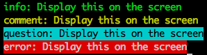

# 排程工作（Cron Job）


我們通常會把一些每小時、每 6 小時、每日、每週、每月等等之類固定時間要做的工作丟到 Linux 系統的 crontab 中去執行，通常像是每日要統計昨天網站的活動資訊做數據分析之類的工作，這類的工作通常會花費比較久的時間

> 若是事件驅動的行為，需要花比較多時間執行的話，我們會使用 Queue 的方式做處理，讓網站的回應時間變快，花時間的工作背景處理

> 像是會員使用 Email 當作帳號註冊後，需要發送 Email 確認信給會員，以便確認這個 Email 真的存在

> 但是因為這樣寄送 Email 的時間是不確定的時間（我們沒辦法控制使用者什麼時候來註冊）

> 而且寄送 Email 的執行時間又特別的長，所以只能用 Queue 的方式來處理

## 終端機顯示資訊

在使用 Laravel Cronjob 的時候，我們為了知道目前處理的狀況，我們可能會需要在終端機（Terminal）上顯示處理的一些相關訊息，除了一般的 `echo` 外，我們可以這樣做：

```php
<?php
class CronjobCommercialEmail extends Command {
	
	// ...前略
	
	public function fire()
    {
        $this->info('info: Display this on the screen');
        $this->comment('comment: Display this on the screen');
        $this->question('question: Display this on the screen');
        $this->error('error: Display this on the screen');
    }
}
```

這樣我們在終端機畫面就會看到像這樣的訊息：



因為通常 Cronjob 通常會處理很久，我們這樣使用可以快速的幫我們知道目前處理的狀況～

## Linux crontab 系統設定

我們通常會在命令列用 `$ crontab -e` 的方式去編輯排程工作

```shell
$ crontab -e
```

在用到 crontab 的時候，我們需要瞭解怎麼設定排程工作的執行時間，整個的 crontab 的設定可能會像這樣：

```shell
# 每天凌晨 3 點統計昨天的 Pageview
0 3 * * * /usr/bin/php /home/kejyun/laravel4/artisan cronjob:statisticYesterdayPageview
```

在前方可以看到有 5 個數字可以做設定，依序分別代表的意思為：

 * 分鐘 (0-59)
 * 小時 (0-23)
 * 每個月第幾天 (1-31)
 * 月份 (1-12)
 * 每週的第幾天 (0-6)
  * 0：星期日
  * 1：星期一
  * 2：星期二
  * 3：星期三
  * 4：星期四
  * 5：星期五
  * 6：星期六

這 5 個參數之間用空白隔開，每個參數除了設定單一個數字，也可以用逗號(,)去隔開設定相同單位的時間設定，像是：

```shell
# 每天凌晨 4 點及 16 點寄送廣告信
0 4,16 * * * /usr/bin/php /home/kejyun/laravel4/artisan cronjob:sendCommercialMail
```

這裏有一些相關的設定範例可以當作參考：

```shell
# 每小時的第 18 分鐘執行
18 * * * *

# 在每個禮拜二每小時的第 18 分鐘執行
18 * * * 2

# 你也可以每隔一段時間去執行 crontab
# 如果我們每 15 分鐘要去執行，你可以用這樣的格式 */15
# 這樣的意思是將分鐘數，切割成（除以）每 15 分鐘執行
*/15 * * * *

# 每 2 小時執行
0 */2 * * *

# 每 2 小時又 20 分鐘執行
*/20 */2 * * *
```

你可以在 crontab 最上方指定 Email，在執行完成後寄送 email 通知

```shell
MAILTO="kejyun@gmail.com"
```

然後在 crontab 最後加上 `> /dev/null 2>&1`，把結果丟到垃圾桶

```shell
> /dev/null 2>&1
```


## 文章
* [Practical Laravel – Using Cron Jobs in Laravel](http://maxoffsky.com/code-blog/practical-laravel-using-cron-jobs-in-laravel/)
* [A visual crontab editor](http://www.corntab.com/pages/crontab-gui)
* [Command - Laravel 為網頁藝術家創造的 PHP 框架](http://laravel.tw/docs/4.2/commands)
* [Command - Laravel 為網頁藝術家創造的 PHP 框架](http://laravel.tw/docs/4.2/commands)
* [Queues vs cron jobs](http://laravel.io/forum/04-30-2014-queues-vs-cron-jobs)

